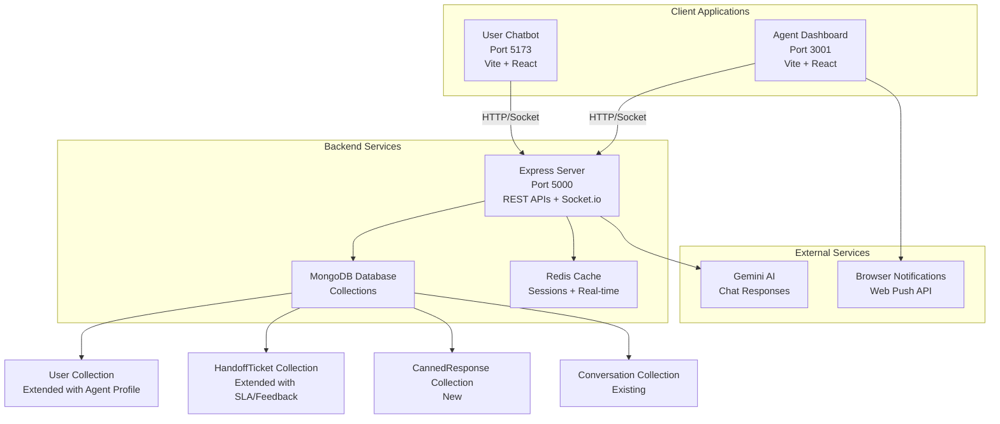

# Design Document: Agent Dashboard

## Overview

The Agent Dashboard is a professional React-based web application that enables customer service agents to handle human handoff requests from the PPC chatbot system. Built as a separate application running on port 3001, it integrates seamlessly with the existing PPC infrastructure while providing a modern, efficient interface for multi-chat management, real-time communication, and performance tracking.

The system follows a hybrid architecture approach, extending existing database models and API endpoints while introducing new agent-specific functionality. The design prioritizes user experience, scalability, and maintainability to ensure professional-grade customer service operations.

## Architecture

### System Architecture Overview



### Component Integration Strategy

**Monorepo Structure:**
```
project-root/
├── client/              # Existing user chatbot (Port 5173)
├── agent-dashboard/     # New agent application (Port 3001)
├── server/             # Shared backend (Port 5000)
└── shared/             # Common types and utilities
```

**Key Integration Points:**
- **Shared Backend:** Both applications use the same Express server and database
- **Role-Based APIs:** Single API endpoints with role-based data filtering
- **Real-time Communication:** Shared Socket.io server with different room strategies
- **Authentication:** Extended JWT system supporting multiple user roles

## Components and Interfaces

### Frontend Component Architecture

#### Agent Dashboard Application Structure

```
agent-dashboard/src/
├── components/
│   ├── auth/
│   │   ├── LoginForm.tsx           # Agent authentication
│   │   └── ProtectedRoute.tsx      # Role-based route protection
│   ├── layout/
│   │   ├── DashboardLayout.tsx     # Main layout with sidebar
│   │   ├── Sidebar.tsx             # Navigation and status controls
│   │   └── Header.tsx              # Top bar with notifications
│   ├── queue/
│   │   ├── TicketQueue.tsx         # Pending tickets list
│   │   ├── TicketCard.tsx          # Individual ticket preview
│   │   ├── QueueFilters.tsx        # Priority/department filters
│   │   └── AutoAssignmentPanel.tsx # Assignment controls
│   ├── chat/
│   │   ├── ChatWorkspace.tsx       # Multi-tab chat interface
│   │   ├── ChatWindow.tsx          # Individual conversation
│   │   ├── MessageList.tsx         # Chat message display
│   │   ├── MessageInput.tsx        # Message composition
│   │   ├── TypingIndicator.tsx     # Real-time typing status
│   │   └── ChatTabs.tsx            # Tab management
│   ├── templates/
│   │   ├── TemplateLibrary.tsx     # Canned responses browser
│   │   ├── TemplateSearch.tsx      # Search and filter templates
│   │   ├── TemplateEditor.tsx      # Create/edit templates
│   │   └── TemplateInserter.tsx    # Quick template insertion
│   ├── performance/
│   │   ├── AgentStats.tsx          # Individual performance metrics
│   │   ├── TeamDashboard.tsx       # Supervisor team view
│   │   ├── SLATimer.tsx            # Response deadline tracking
│   │   └── FeedbackDisplay.tsx     # Customer satisfaction
│   ├── notifications/
│   │   ├── NotificationManager.tsx # Browser notification handler
│   │   ├── AlertBanner.tsx         # In-app alert system
│   │   └── SoundManager.tsx        # Audio notification system
│   └── common/
│       ├── StatusIndicator.tsx     # Agent availability display
│       ├── PriorityBadge.tsx       # Ticket priority visualization
│       └── LanguageBadge.tsx       # Customer language indicator
├── hooks/
│   ├── useSocket.ts                # Socket.io connection management
│   ├── useNotifications.ts         # Browser notification handling
│   ├── useAutoAssignment.ts        # Ticket assignment logic
│   └── usePerformanceMetrics.ts    # Real-time statistics
├── services/
│   ├── api.ts                      # REST API client
│   ├── socket.ts                   # Socket event handlers
│   ├── notifications.ts            # Notification service
│   └── storage.ts                  # Local storage management
├── stores/
│   ├── authStore.ts                # Authentication state
│   ├── ticketStore.ts              # Ticket queue management
│   ├── chatStore.ts                # Active conversations
│   └── settingsStore.ts            # User preferences
└── types/
    ├── agent.ts                    # Agent-specific types
    ├── ticket.ts                   # Ticket and queue types
    └── chat.ts                     # Chat message types
```

#### Key UI Components Design

**1. Dashboard Layout (Hybrid Approach)**
- **Left Sidebar:** Agent status, ticket queue, navigation
- **Main Content:** Chat workspace with tabbed interface
- **Right Panel:** Contextual information (customer details, templates)

**2. Multi-Chat Workspace**
- **Browser-style tabs** for up to 5 concurrent conversations
- **Tab indicators** for unread messages and priority levels
- **Keyboard shortcuts** for quick navigation (Ctrl+1-5)
- **Draft preservation** when switching between tabs

**3. Ticket Queue Interface**
- **Card layout** with priority badges and wait time indicators
- **Real-time updates** with smooth animations
- **Smart filtering** by department, language, and priority
- **Auto-refresh** with visual loading states

**4. Template System**
- **Slash commands** (/greeting) for quick insertion
- **Toolbar button** with searchable dropdown
- **Keyboard shortcut** (Ctrl+Space) for power users
- **Preview and edit** before sending

### Backend Component Extensions

#### API Route Structure

```
server/src/routes/
├── auth.routes.ts              # Extended authentication
├── tickets.routes.ts           # Ticket management
├── chat.routes.ts              # Chat communication
├── templates.routes.ts         # Canned responses
├── agent.routes.ts             # Agent status and stats
├── team.routes.ts              # Supervisor functions
└── feedback.routes.ts          # Customer satisfaction
```

#### Socket Event Handlers

```
server/src/socket/handlers/
├── agentHandler.ts             # Agent connection and status
├── ticketHandler.ts            # Ticket assignment and updates
├── chatHandler.ts              # Extended for agent communication
├── notificationHandler.ts      # Browser notification triggers
└── supervisorHandler.ts        # Team monitoring events
```

## Data Models

### Extended User Model

```typescript
interface IUser extends Document {
  // Existing fields
  _id: ObjectId;
  name: string;
  email: string;
  password: string;
  language: 'en' | 'te' | 'hi';
  
  // New fields
  role: 'customer' | 'agent' | 'supervisor' | 'admin';
  
  // Agent-specific profile (optional, only for agents)
  agentProfile?: {
    department: 'Legal' | 'RTI' | 'Emergency' | 'General' | 'Education';
    skills: string[];                    // ['English', 'Telugu', 'Hindi']
    status: 'available' | 'busy' | 'away' | 'offline';
    currentChats: ObjectId[];            // Active HandoffTicket IDs
    maxConcurrentChats: number;          // Default: 5
    
    performanceMetrics: {
      totalChatsHandled: number;
      avgResponseTime: number;           // seconds
      avgRating: number;                 // 1-5 stars
      totalFeedbacks: number;
      slaCompliance: number;             // percentage
      lastUpdated: Date;
    };
    
    preferences: {
      browserNotifications: boolean;
      soundAlerts: boolean;
      soundVolume: number;               // 0-100
      autoAcceptTickets: boolean;
      theme: 'light' | 'dark';
    };
    
    workSchedule: {
      timezone: string;
      workingHours: {
        start: string;                   // "09:00"
        end: string;                     // "17:00"
      };
      workingDays: number[];             // [1,2,3,4,5] for Mon-Fri
    };
  };
  
  createdAt: Date;
  updatedAt: Date;
}
```

### Extended HandoffTicket Model

```typescript
interface IHandoffTicket extends Document {
  // Existing fields
  _id: ObjectId;
  userId: ObjectId;                      // Customer who requested
  conversationId: ObjectId;
  status: 'waiting' | 'assigned' | 'resolved' | 'cancelled' | 'transferred';
  reason: string;
  conversationContext: IMessage[];
  createdAt: Date;
  
  // Extended fields
  assignedAgentId?: ObjectId;
  assignedAt?: Date;
  resolvedAt?: Date;
  resolutionNotes?: string;
  
  // New fields
  priority: 1 | 2 | 3 | 4 | 5;          // 1=lowest, 5=emergency
  customerLanguage: 'en' | 'te' | 'hi';
  department: 'Legal' | 'RTI' | 'Emergency' | 'General' | 'Education';
  
  slaTracking: {
    targetResponseTime: number;          // minutes
    firstResponseAt?: Date;
    slaMetAt: boolean;
    escalatedAt?: Date;
    escalatedTo?: ObjectId;              // Supervisor ID
  };
  
  assignmentHistory: Array<{
    agentId: ObjectId;
    assignedAt: Date;
    unassignedAt?: Date;
    reason: 'accepted' | 'transferred' | 'disconnected' | 'escalated';
  }>;
  
  customerFeedback?: {
    rating: 1 | 2 | 3 | 4 | 5;
    comment?: string;
    submittedAt: Date;
  };
  
  autoAssignmentData: {
    attemptCount: number;
    lastAttemptAt?: Date;
    eligibleAgents: ObjectId[];          // Agents who could handle this
    assignmentScore?: {
      agentId: ObjectId;
      departmentMatch: number;           // 0-40 points
      languageMatch: number;             // 0-30 points
      workloadScore: number;             // 0-30 points
      totalScore: number;                // 0-100 points
    };
  };
}
```

### New CannedResponse Model

```typescript
interface ICannedResponse extends Document {
  _id: ObjectId;
  title: string;                         // "Greeting Message", "Legal Disclaimer"
  content: string;                       // Template text with placeholders
  category: 'greeting' | 'legal' | 'rti' | 'emergency' | 'closing' | 'transfer' | 'escalation';
  
  type: 'personal' | 'shared';
  createdBy: ObjectId;                   // Agent who created it
  department?: 'Legal' | 'RTI' | 'Emergency' | 'General' | 'Education' | 'All';
  
  language: 'en' | 'te' | 'hi' | 'all';
  tags: string[];                        // ['formal', 'quick', 'apology']
  
  placeholders: Array<{
    key: string;                         // {{customerName}}
    description: string;                 // "Customer's first name"
    defaultValue?: string;
  }>;
  
  usageStats: {
    totalUses: number;
    lastUsedAt?: Date;
    usedByAgents: ObjectId[];            // Agents who have used this
    avgRating?: number;                  // Agent feedback on template
  };
  
  isActive: boolean;
  createdAt: Date;
  updatedAt: Date;
}
```

### New AgentSession Model

```typescript
interface IAgentSession extends Document {
  _id: ObjectId;
  agentId: ObjectId;
  loginTime: Date;
  logoutTime?: Date;
  
  sessionMetrics: {
    chatsHandled: number;
    avgResponseTime: number;             // seconds
    totalActiveTime: number;             // minutes
    slaCompliance: number;               // percentage
    customerSatisfaction: number;        // average rating
  };
  
  statusHistory: Array<{
    status: 'available' | 'busy' | 'away' | 'offline';
    changedAt: Date;
    duration?: number;                   // minutes in this status
  }>;
  
  ticketsHandled: ObjectId[];            // HandoffTicket IDs
  
  connectionInfo: {
    ipAddress: string;
    userAgent: string;
    lastPingAt: Date;
    disconnectionCount: number;
  };
  
  isActive: boolean;
}
```

## Correctness Properties

*A property is a characteristic or behavior that should hold true across all valid executions of a system—essentially, a formal statement about what the system should do. Properties serve as the bridge between human-readable specifications and machine-verifiable correctness guarantees.*

### Authentication and Authorization Properties

**Property 1: Agent Authentication Consistency**
*For any* valid agent credentials, authentication should succeed and return appropriate role-based permissions and dashboard access
**Validates: Requirements 1.1, 1.2**

**Property 2: Role-Based Access Control**
*For any* user with agent/supervisor/admin role, the system should grant access only to features appropriate for their role level
**Validates: Requirements 1.4, 1.6**

**Property 3: Session Expiration Handling**
*For any* expired agent session, the system should automatically redirect to login and clear all sensitive data from memory
**Validates: Requirements 1.5**

### Queue Management Properties

**Property 4: Ticket Queue Ordering**
*For any* collection of pending tickets, the queue should display them ordered by priority (descending) then creation time (ascending)
**Validates: Requirements 2.1**

**Property 5: Real-time Queue Synchronization**
*For any* ticket state change (created, accepted, resolved), all connected agents should see the updated queue state within 2 seconds
**Validates: Requirements 2.2, 2.3**

**Property 6: Queue Filtering Accuracy**
*For any* filter criteria (department, language, priority), the displayed tickets should contain only items matching all selected filters
**Validates: Requirements 2.5**

### Multi-Chat Workspace Properties

**Property 7: Chat Capacity Enforcement**
*For any* agent, the system should prevent opening more than their configured maximum concurrent chats (default 5)
**Validates: Requirements 3.1**

**Property 8: Tab State Preservation**
*For any* chat tab switch, message drafts and scroll position should be preserved and restored when returning to the original tab
**Validates: Requirements 3.3**

**Property 9: Chat Tab Cleanup**
*For any* resolved chat, closing the tab should remove it from the workspace and update the agent's availability status appropriately
**Validates: Requirements 3.5**

### Agent Status Management Properties

**Property 10: Status Transition Validity**
*For any* agent status change, the new status should be one of the valid values (available, busy, away, offline) and should trigger appropriate system behaviors
**Validates: Requirements 4.1, 4.2, 4.3**

**Property 11: Automatic Status Updates**
*For any* agent reaching maximum chat capacity, the system should automatically set their status to busy and prevent new assignments
**Validates: Requirements 4.6**

**Property 12: Workload Tracking Accuracy**
*For any* agent, the displayed active chat count should always match the number of assigned, unresolved tickets
**Validates: Requirements 4.5**

### Real-time Communication Properties

**Property 13: Message Delivery Guarantee**
*For any* message sent by an agent or customer, it should be delivered to the intended recipient within 5 seconds under normal network conditions
**Validates: Requirements 5.1, 5.2**

**Property 14: Typing Indicator Synchronization**
*For any* typing activity in a conversation, both participants should see accurate typing indicators that reflect the current typing state
**Validates: Requirements 5.3**

**Property 15: Connection Recovery**
*For any* connection loss, the system should attempt automatic reconnection and restore the agent's previous state when connection is reestablished
**Validates: Requirements 5.5**

### Auto-Assignment Algorithm Properties

**Property 16: Assignment Scoring Consistency**
*For any* pending ticket and set of available agents, the auto-assignment algorithm should consistently calculate scores based on department match (40%), language match (30%), and workload (30%)
**Validates: Requirements 14.1, 14.2, 14.3**

**Property 17: Assignment Fairness**
*For any* group of equally qualified agents, tickets should be distributed to maintain balanced workloads over time
**Validates: Requirements 14.3**

**Property 18: Emergency Assignment Priority**
*For any* ticket with priority level 5 (emergency), the system should bypass the 30-second manual window and assign immediately to the best available agent
**Validates: Requirements 10.3, 14.1**

### Browser Notification Properties

**Property 19: Notification Permission Handling**
*For any* agent login, if browser notifications are not permitted, the system should provide alternative in-app alerts without degrading functionality
**Validates: Requirements 13.2, 13.5**

**Property 20: Priority-Based Notification Escalation**
*For any* ticket with priority 4 or 5, the system should send browser notifications with distinct visual and audio indicators
**Validates: Requirements 13.1, 13.6, 10.1**

### Template System Properties

**Property 21: Template Search Accuracy**
*For any* search query in the template library, results should include all templates where the query matches title, content, tags, or category
**Validates: Requirements 16.2**

**Property 22: Placeholder Substitution**
*For any* template with dynamic placeholders, inserting the template should correctly replace all placeholders with appropriate customer data
**Validates: Requirements 16.4**

**Property 23: Template Usage Tracking**
*For any* template usage, the system should accurately increment usage statistics and update the most-used template rankings
**Validates: Requirements 16.6**

### SLA Timer Properties

**Property 24: SLA Timer Accuracy**
*For any* assigned ticket, the SLA timer should accurately reflect time remaining based on priority level (emergency: 2min, high: 5min, normal: 10min)
**Validates: Requirements 17.1, 17.2**

**Property 25: SLA Escalation Triggers**
*For any* ticket exceeding its SLA deadline, the system should automatically alert supervisors and escalate the ticket
**Validates: Requirements 17.4**

**Property 26: SLA Compliance Calculation**
*For any* agent or team, SLA compliance rates should be calculated as the percentage of tickets where first response occurred within the target time
**Validates: Requirements 17.5**

### Customer Feedback Properties

**Property 27: Feedback Association**
*For any* submitted customer feedback, it should be correctly associated with the specific ticket and agent who handled the conversation
**Validates: Requirements 15.4**

**Property 28: Rating Aggregation**
*For any* agent with multiple feedback ratings, the displayed average should be calculated correctly and updated in real-time
**Validates: Requirements 15.5**

### Supervisor Monitoring Properties

**Property 29: Team Status Visibility**
*For any* supervisor, the team dashboard should display real-time status of all agents in their department with accurate availability and workload information
**Validates: Requirements 9.1**

**Property 30: Manual Assignment Override**
*For any* supervisor reassignment action, the ticket should be transferred to the specified agent regardless of auto-assignment rules
**Validates: Requirements 9.3, 14.5**

## Error Handling

### Connection Error Handling

**Agent Disconnection Management:**
- **Grace Period:** 2-minute window for automatic reconnection
- **State Preservation:** Active chats remain assigned during grace period
- **Customer Communication:** Customers see "Agent is reconnecting..." message
- **Automatic Reassignment:** After grace period, tickets are reassigned to available agents
- **Reconnection Recovery:** Agents can resume active chats if reconnecting within grace period

**Socket Connection Failures:**
- **Automatic Retry:** Exponential backoff strategy (1s, 2s, 4s, 8s intervals)
- **Fallback Polling:** HTTP polling fallback if WebSocket fails
- **Connection Status:** Visual indicators for connection state
- **Offline Mode:** Limited functionality when completely disconnected

### API Error Handling

**Authentication Errors:**
- **Token Expiration:** Automatic refresh attempt, redirect to login if failed
- **Permission Denied:** Clear error messages with suggested actions
- **Rate Limiting:** Graceful degradation with retry timers

**Data Validation Errors:**
- **Client-Side Validation:** Immediate feedback on form inputs
- **Server-Side Validation:** Detailed error messages for correction
- **Conflict Resolution:** Optimistic updates with rollback on conflicts

### Browser Notification Errors

**Permission Handling:**
- **Permission Denied:** Fallback to in-app notifications
- **Browser Compatibility:** Feature detection with graceful degradation
- **Notification Failures:** Retry mechanism with exponential backoff

### Auto-Assignment Failures

**No Available Agents:**
- **Queue Management:** Tickets remain in queue with priority indicators
- **Supervisor Alerts:** Automatic escalation after threshold time
- **Customer Communication:** Estimated wait time updates

**Assignment Conflicts:**
- **Race Condition Handling:** Database-level locking for ticket assignment
- **Duplicate Assignment Prevention:** Atomic operations for ticket acceptance
- **Rollback Mechanisms:** Automatic cleanup of failed assignments

## Testing Strategy

### Dual Testing Approach

The Agent Dashboard requires comprehensive testing using both unit tests and property-based tests to ensure reliability and correctness across all scenarios.

**Unit Tests:**
- Focus on specific examples, edge cases, and error conditions
- Test individual component behavior and API endpoints
- Validate UI interactions and state management
- Cover integration points between components

**Property-Based Tests:**
- Verify universal properties across all inputs using randomized testing
- Test system behavior under various load conditions
- Validate business rules and constraints
- Ensure data consistency across concurrent operations

### Property-Based Testing Configuration

**Testing Framework:** fast-check (JavaScript/TypeScript property-based testing library)
**Test Configuration:**
- Minimum 100 iterations per property test
- Custom generators for domain-specific data (tickets, agents, messages)
- Shrinking enabled for minimal counterexample identification

**Property Test Tags:**
Each property-based test must include a comment referencing its design document property:
```typescript
// Feature: agent-dashboard, Property 16: Assignment Scoring Consistency
```

### Testing Categories

**Authentication and Authorization Testing:**
- Property tests for role-based access control
- Unit tests for login/logout flows
- Integration tests for JWT token handling

**Real-time Communication Testing:**
- Property tests for message delivery guarantees
- Unit tests for socket event handling
- Load tests for concurrent user scenarios

**Auto-Assignment Algorithm Testing:**
- Property tests for scoring consistency and fairness
- Unit tests for edge cases (no available agents, equal scores)
- Performance tests for assignment speed

**UI Component Testing:**
- Property tests for state preservation across tab switches
- Unit tests for user interactions and form validation
- Visual regression tests for consistent styling

**Database Consistency Testing:**
- Property tests for data integrity across operations
- Unit tests for model validation and relationships
- Transaction tests for concurrent modifications

### Test Data Generation

**Custom Generators:**
- Agent profiles with realistic department/skill combinations
- Tickets with varied priorities, languages, and contexts
- Chat messages with different content types and formatting
- Performance metrics within realistic ranges

**Test Environment:**
- Isolated test database with seed data
- Mock external services (Gemini AI, browser notifications)
- Controlled time progression for SLA testing
- Network simulation for connection testing 